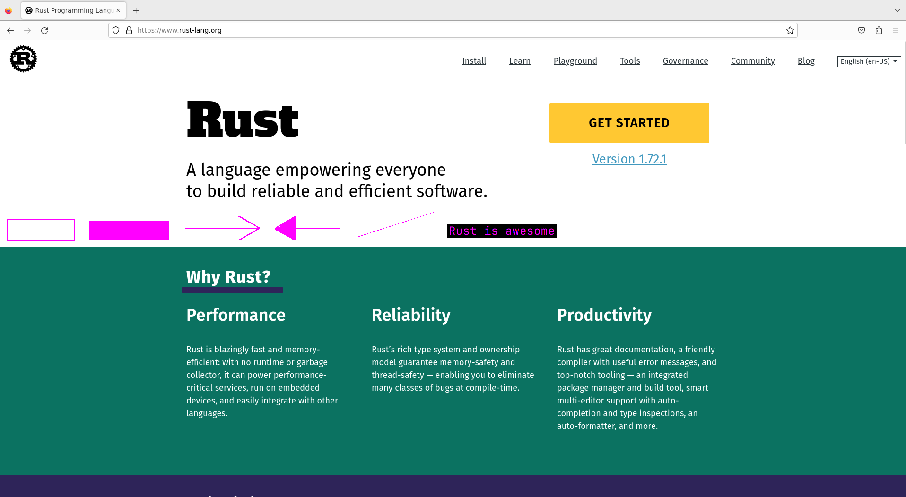

[](https://github.com/kakoc/birdy)
[](https://crates.io/crates/birdy)
[](https://docs.rs/birdy/latest/birdy)
[](https://github.com/kakoc/birdy/actions/workflows/rust.yml)

Screenshot tool for Linux.  
Supports both X11 and Wayland.  

People told me that it also works on Windows and partially on MacOS.  
Since I'm not using neither MacOS or Windows at all there are no any guarantees related to these platforms.  
If you want to add a support for MacOS or Windows - PRs are welcome.  



## Installation

```bash
cargo install birdy --locked
```

## Usage

```
birdy --help

Hotkeys while running (see lower for cli args):

Enter - take a screenshot of selected area, save to a clipboard and exit

f - take a screenshot where selected area is focused, save to a clipboard and exit

a - draw an arrow

z - draw a filled arrow

l - draw a line

r - draw a rectangular border

p - draw a filled rectangle

b - draw a blurred rectangle

t - draw a text

Tab - toggle latest drawn shape between filled/not filled states

Esc - exit

Usage: birdy [OPTIONS]

Options:
  -b, --border-color <BORDER_COLOR>
          

  -s, --screen <SCREEN>
          

  -d, --dir <DIR>
          save directory

  -c, --clipboard
          save to clipboard instead of path

  -h, --help
          Print help (see a summary with '-h')
```
